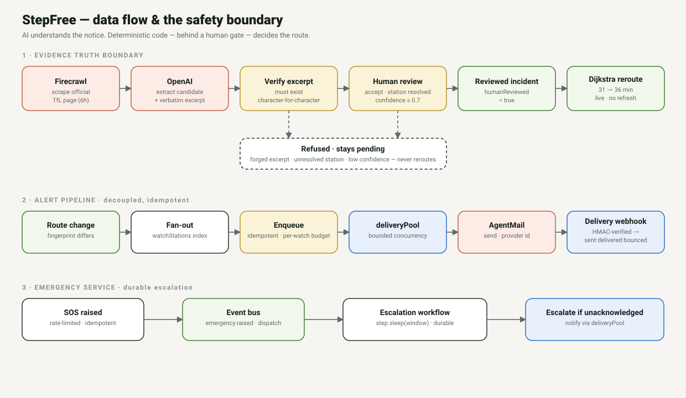
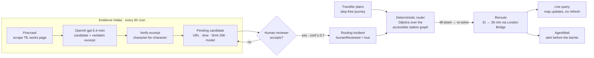
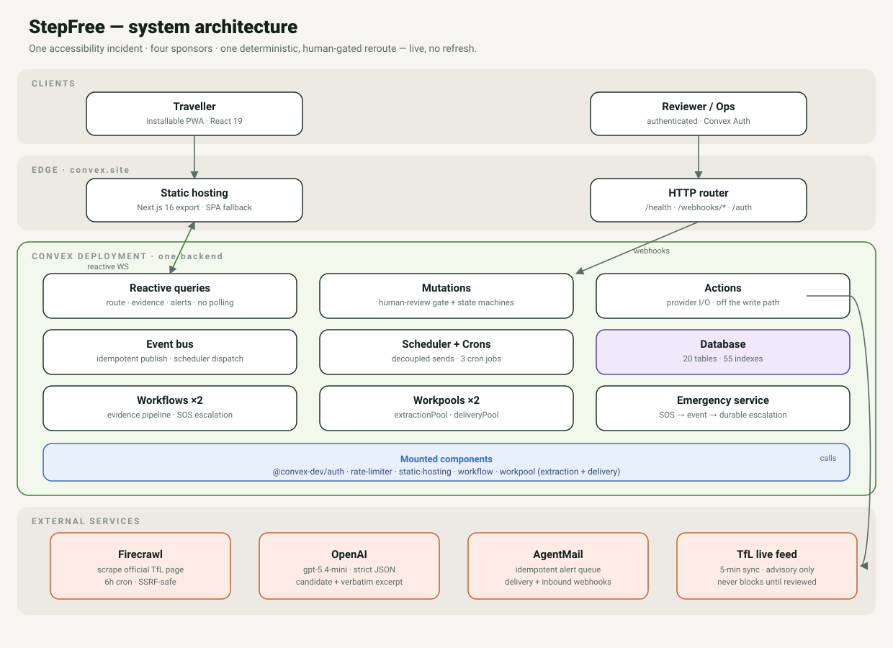
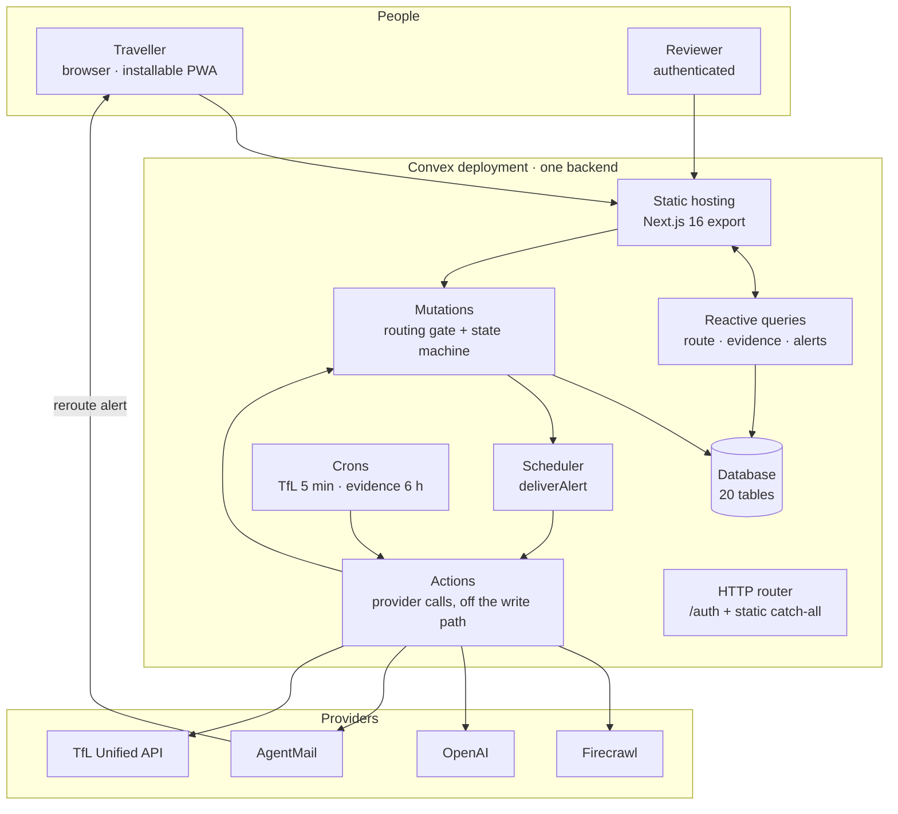
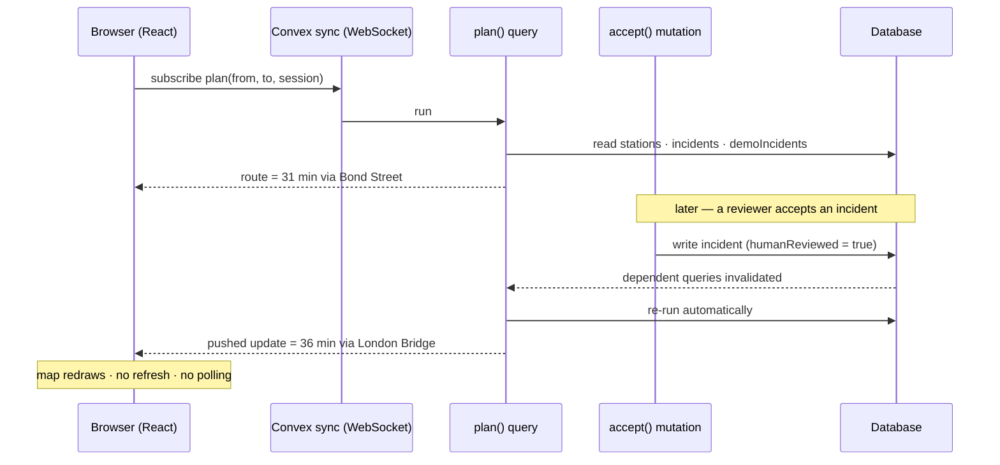
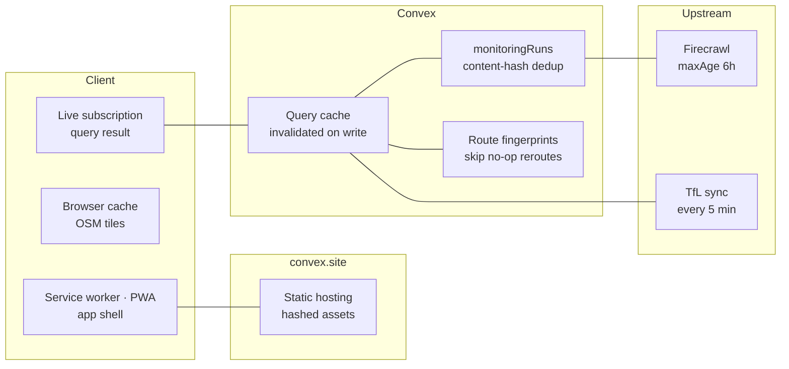
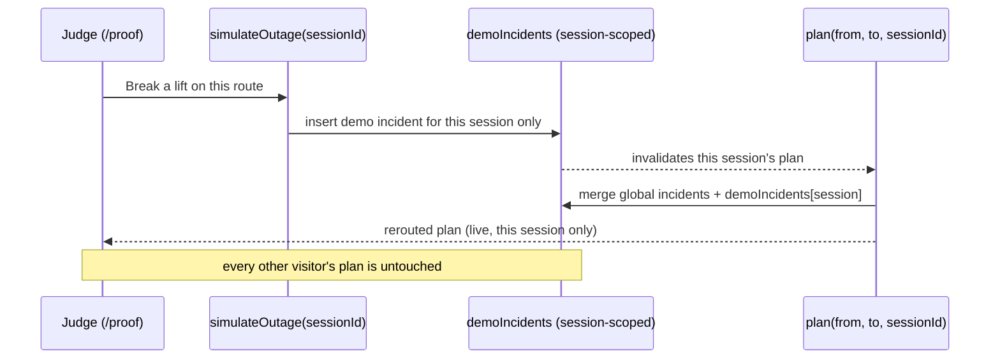
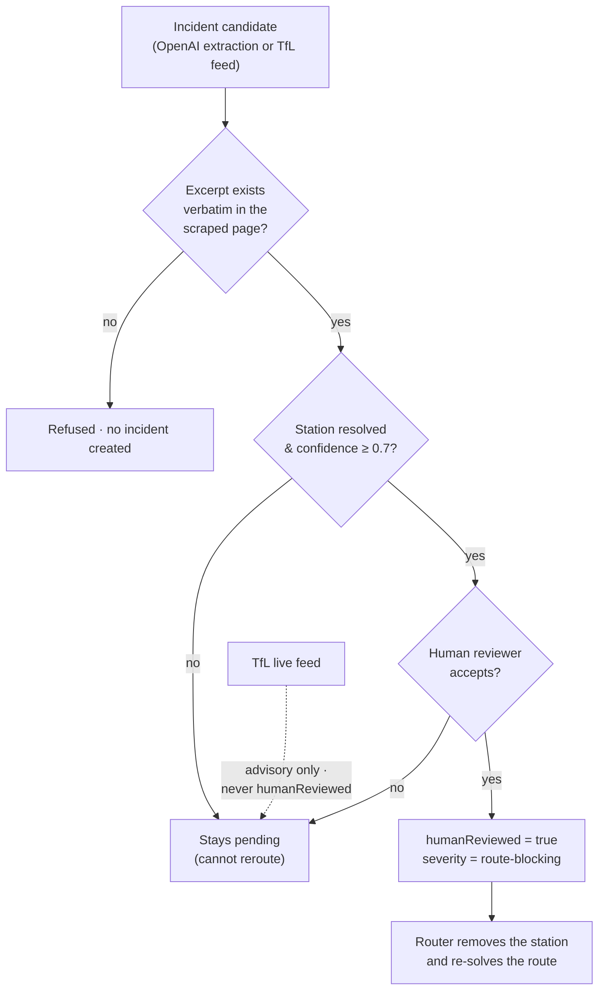
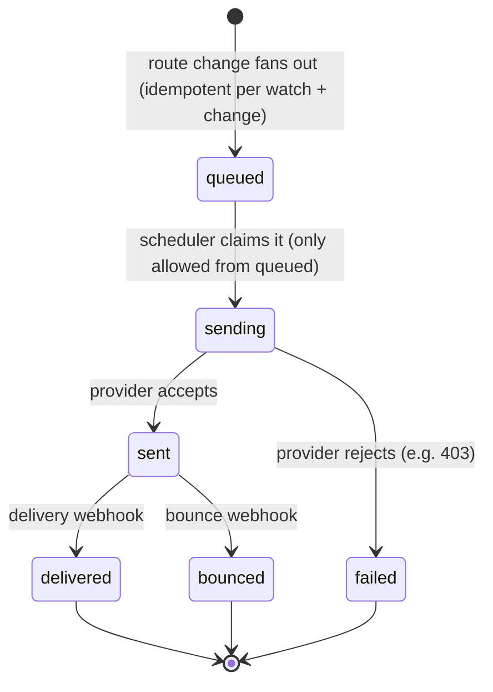
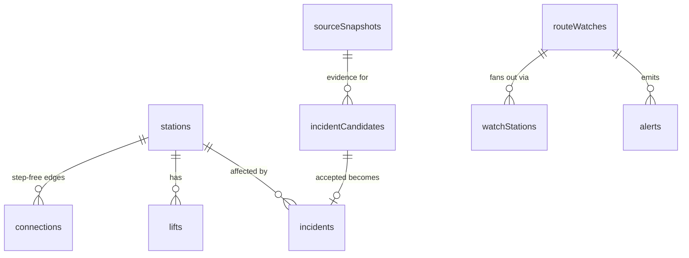

# StepFree

> ## The train doors close behind you. You wheel toward the only lift up — and the sign reads **OUT OF ORDER**. You are stranded underground, on the wrong platform, and no one is coming.

For a wheelchair user, one broken lift is not a delay. **It is a dead end.**

And here is the cruel part: every journey planner in the world will still call that station "step-free" and let you roll straight into the trap — because none of them know the one lift you depend on failed twenty minutes ago. You find out at the barrier. Too late to choose another way. Too late to turn back.

**StepFree exists to reach you _before_ you get there.**

▶ **[Watch a lift break and the route survive — live, no login](https://whimsical-ferret-778.convex.site/proof)** · [Live app](https://whimsical-ferret-778.convex.site) · [Repo](https://github.com/treasure567/stepfree) · Video: <!-- VIDEO_URL --> _coming_

---

## This is not hypothetical. It happens every single day.

_Real people. Real words. Every quote links to the original — go read them._

> 🇬🇧 A 20-year-old wheelchair user had **"three panic attacks"** when a broken lift and the wrong platform left her stranded — more than two hours on a single journey.
> — [ITV News, 2025](https://www.itv.com/news/london/2025-08-15/wheelchair-user-had-three-panic-attacks-after-frustrating-london-train-journey)

> 🇬🇧 A wheelchair user in south London says he has been left stranded in step-free station lifts **"30 times this year"** — one broken lift after another.
> — [Southwark News, 2026](https://southwarknews.co.uk/area/borough/wheelchair-user-makes-the-shocking-claim-that-he-has-been-stranded-in-station-lifts-30-times-this-year/)

> 🇺🇸 **"People with disabilities are stranded every day … because of constant elevator outages."**
> — Madeleine Richman, attorney, in [Streetsblog NYC, 2024](https://nyc.streetsblog.org/2024/10/03/subway-elevators-are-not-just-a-nice-lift-but-a-basic-civil-right)

> 🇬🇧 Ashley Armstrong, 28, who has cerebral palsy, was **left trapped for an hour** at a tram stop by a broken lift — and no one answered when she called for help.
> — [Manchester Evening News, 2024](https://www.pressreader.com/uk/manchester-evening-news/20240329/281715504622517)

> 🇺🇸 A public elevator by Portland's Union Station stayed broken for **two years**; people in wheelchairs were **carried down the stairs**, and neighbours said they felt **"forgotten and ignored."**
> — [KGW, Portland](https://www.kgw.com/article/news/investigations/broken-elevator-portland-union-station-neighbors-stuck-two-years/283-cebad000-93fa-428e-bdac-dac3b353d947)

> 🇺🇸 At a Metro-North station, staff were reduced to **carrying wheelchair users down the steps** while the lift went unfixed for months.
> — [Mid Hudson News, 2026](https://midhudsonnews.com/2026/04/12/metro-north-slow-to-fix-broken-elevator-at-train-station-wheelchairs-being-carried/)

> 🇨🇦 A woman in a wheelchair said she felt **"shafted"** by a broken elevator — at a _brand-new_ station.
> — [CBC News, 2018](https://www.cbc.ca/news/canada/toronto/ttc-accessibility-broken-elevator-vaughan-1.4656090)

> 🇺🇸 **"When a subway platform is a trap."** CBS's _60 Minutes_ called it, plainly, **"the New York City subway's accessibility problem."**
> — [New York Daily News](https://www.pressreader.com/usa/new-york-daily-news/20141213/281814282203481) · [CBS News](https://www.cbsnews.com/news/the-new-york-city-subway-accessibility-problem-60-minutes/)

> 👶 **The forums are full of it, too.** A London mum, unable to lift her baby and pram up a flight of station steps with no step-free route, was flatly refused help by staff — left, she wrote, feeling she had to **"apologise for existing."**
> — [Mumsnet forum thread](https://www.mumsnet.com/talk/am_i_being_unreasonable/1806808-Refused-help-with-pram-by-tube-station-staff-Surely-that-is-not-right)

### The scale of it — this is millions of people

- 🇬🇧 **London:** only about **a third of Tube stations are step-free** ([TfL](https://tfl.gov.uk/transport-accessibility/wheelchair-access-and-avoiding-stairs)) — the Mayor's _target_ is a mere **50% by 2030** ([Time Out](https://www.timeout.com/london/news/10-more-london-tube-stations-have-been-prioritised-to-get-step-free-access-080524)) — and only **22%** have fully accessible trains ([SW Londoner](https://www.swlondoner.co.uk/news/21072023-only-22-of-londons-tube-stations-have-fully-accessible-trains)).
- 🇺🇸 **New York:** only about **30% of subway stations even have an elevator**, and **nearly 1 in 10 elevators is out of service at any given moment** ([amNewYork / 2023 NYC Council report](https://www.amny.com/nyc-transit/nearly-10-of-mta-elevators-out-of-service-at-any-given-time-report/)).
- 👶🧓🧳 And it is **not just wheelchair users.** It is parents with buggies, older travellers, a traveller with heavy luggage, anyone on crutches or with a leg in a cast — everyone the stairs quietly shut out.

---

## So we built StepFree

**StepFree is a live step-free layer for public transit.** When a station lift fails, it catches the evidence, reroutes a wheelchair or mobility-impaired traveller around the broken lift, and emails them the new route **before they reach the barrier** — while there is still time to choose another way.

**Meet Maya.** She plans **Waterloo → Barbican, 31 min via Bond Street.** Bond Street's lift fails. Before she reaches it, StepFree reroutes her via **London Bridge (36 min, +5 min)** — live, on the map, with no page refresh — and emails her the new way down. She never hits the wall.

Built for the Convex **All Gas** hackathon on **Convex + Firecrawl + OpenAI + AgentMail**.

### What we used from each hackathon provider

- **Convex** — the entire backend is one Convex deployment: **102 functions** (35 public queries · 25 public mutations · 3 public actions · 39 internal), **21 tables**, **56 indexes**, the **reactive** no-refresh reroute, the **scheduler** (6 hand-offs), **4 cron jobs**, the **HTTP router** (4 routes), and **5 mounted components** — Convex **Auth**, **`@convex-dev/rate-limiter`** (17 named limits), **`@convex-dev/static-hosting`** (serves this whole app from `convex.site`), **`@convex-dev/workflow`** (2 durable workflows), and **`@convex-dev/workpool`** (2 bounded pools). The deterministic Dijkstra router and the human-review gate live inside Convex functions.
- **Firecrawl** — scrapes the official TfL _lifts & escalators works and closures_ page to clean markdown on a 6-hour cron; a hard-coded URL keeps it SSRF-safe and every scrape is content-hashed for provenance and dedup (`convex/monitoring.ts`).
- **OpenAI** — `gpt-5.4-mini` via the Responses API (strict `json_schema`, `store: false`) turns that markdown into incident candidates, each carrying a **verbatim source excerpt** we re-verify character-for-character before trusting it. The model never chooses a route (`convex/monitoring.ts`).
- **AgentMail** — delivers the reroute alert (and account codes) through an idempotent queue with a provider message id and a `queued → sending → sent → delivered/bounced/failed` state machine; delivery receipts and inbound replies return via **HMAC-verified webhooks** (`convex/alerts.ts`, `convex/webhooks.ts`, `convex/http.ts`).

See [By the numbers](#by-the-numbers) for the full inventory and [`docs/architecture.md`](docs/architecture.md) for the system design; every count is reproducible with `scripts/audit-convex.sh`.

- **Live:** https://whimsical-ferret-778.convex.site
- **Judge demo (live, no login):** https://whimsical-ferret-778.convex.site/proof
- **Repo:** https://github.com/treasure567/stepfree
- **Video:** <!-- VIDEO_URL -->

---

## Contents

- [What StepFree does](#what-stepfree-does)
- [By the numbers](#by-the-numbers)
- [Features](#features)
- [How it works](#how-it-works)
- [Architecture](#architecture)
- [System design in depth](#system-design-in-depth)
- [The safety boundary](#the-safety-boundary--read-this-first)
- [The alert pipeline](#the-alert-pipeline)
- [Where each sponsor fits](#where-each-sponsor-fits)
- [Convex components](#convex-components)
- [Convex depth](#convex-depth)
- [Data model](#data-model)
- [The `/proof` judge page](#the-proof-judge-page--what-to-click)
- [Tech stack](#tech-stack)
- [Project layout](#project-layout)
- [Running it yourself](#running-it-yourself)
- [Testing](#testing)
- [Security](#security)
- [Known limitations](#known-limitations)
- [System-design diagrams](#system-design-diagrams)
- [Links](#links)
- [License & attributions](#license--attributions)

---

## What StepFree does

StepFree watches official access notices and live lift feeds, turns what changed into **verified, human-reviewed evidence**, and reroutes a step-free journey around the failure — then warns the traveller by email before they reach the barrier. It optimizes for the one thing conventional planners ignore: **the timing gap** between a lift failing and a traveller arriving at it.

It rests on one boundary:

> **AI can read the notice. It cannot declare a route safe.**

The model reads scraped pages and extracts candidates. It never chooses a path, never decides whether a station is blocked, and never emails anyone on its own. Those are deterministic TypeScript and a human reviewer.

## By the numbers

Reproducible with [`scripts/audit-convex.sh`](scripts/audit-convex.sh).

| | Count | Detail |
| --- | ---: | --- |
| **Convex functions** | **102** | 35 public queries · 25 public mutations · 3 public actions · 4 internal queries · 29 internal mutations · 6 internal actions |
| **Tables** | **21** | fully indexed; no unbounded scans |
| **Indexes** | **56** | every query is index-backed |
| **Mounted components** | **5** | auth · rate-limiter · static-hosting · workflow · workpool (×2 named instances) |
| **Durable workflows** | **2** | evidence pipeline · emergency escalation |
| **Workpools** | **2** | `extractionPool` (scrape/LLM) · `deliveryPool` (outbound) |
| **HTTP routes** | **4** | AgentMail delivery · AgentMail inbound · partner lift-status · health |
| **Cron jobs** | **4** | TfL sync (5 min) · evidence workflow (6 h) · idempotency cleanup (12 h) · stuck-alert reconcile (15 min) |
| **Named rate limits** | **17** | per-session and global buckets on every ingress |
| **Scheduler hand-offs** | **4** | provider I/O and dispatch run off the write path |
| **Automated tests** | **62** | across 12 files (Vitest + `convex-test`) |
| **External services** | **4** | Firecrawl · OpenAI · AgentMail · TfL Unified API |

## Features

- **Live, no-refresh reroute** — break a lift, watch the route re-solve from 31 → 36 minutes on a MapLibre map with an optional immersive 3-D wheelchair simulation.
- **Deterministic Dijkstra routing** behind a strict **human-review gate** — no LLM in the safety decision.
- **Verbatim-excerpt evidence verification** — a model claim only counts if the quote exists character-for-character in the scraped page (SHA-256 provenance on every record).
- **Durable evidence workflow** — scrape → extract → verify → persist, resumable and retryable.
- **Decoupled, idempotent alert pipeline** — station fan-out index, per-watch budget, `queued → sending → sent → delivered/bounced/failed` state machine.
- **Signed webhooks (HMAC-SHA256, timing-safe)** — AgentMail delivery advances the alert state machine; AgentMail inbound parses replies and can pause a watch; a partner lift-status feed lands advisory reports.
- **Event bus** — idempotent publish + scheduler dispatch decouples producers from consumers.
- **Emergency SOS service** — an in-app SOS modal (kind · details · contact) that is rate-limited, idempotent, durably escalated if no one acknowledges, with a traveller/operator note timeline.
- **First-class idempotency** — a shared claim helper guards every ingress (webhooks, SOS, alerts, email codes).
- **Session isolation** — one visitor's `/proof` drill never touches another's view or global state.
- **Operations / reviewer console** (`/ops`) — an authenticated dashboard to triage emergencies, review incident evidence (accept/reject), watch the alert state machine, replay failed events, and trigger evidence / live-feed syncs.
- **Convex Auth** (password + username), **peppered OTP** email verification, and the **rate-limiter** on every entry point.
- **Installable PWA**, static-exported and served from `convex.site`.

## How it works





1. A traveller plans a step-free journey (demo: **Waterloo → Barbican, 31 min via Bond Street**).
2. **Firecrawl** scrapes the official TfL _stations, lifts and escalators works and closures_ page to clean markdown, on a 6-hour cron.
3. **OpenAI** (`gpt-5.4-mini`, strict JSON schema) extracts incident candidates and, for each one, a short **verbatim source excerpt**.
4. StepFree verifies the excerpt exists character-for-character in the Firecrawl markdown, resolves the station name against the graph, hashes the source, and stores the candidate as **pending** with full provenance.
5. A **human reviewer** accepts or rejects each candidate. Only an accepted candidate (verified excerpt + resolved station + confidence ≥ 0.7) becomes a routing incident with `humanReviewed: true`.
6. **Convex** holds all state and serves reactive live queries. The instant Bond Street is blocked, the route re-solves to **London Bridge (36 min, +5 min)** — live, no page refresh, no polling.
7. **AgentMail** emails the traveller the new route and the added time, before they reach the barrier.

## Architecture



The whole product is one Convex deployment. The static-exported Next.js app is served from `convex.site`, every screen subscribes to reactive queries, and the router runs inside the query that reads the plan — so the route and the incident state it was computed from are always consistent.



**Mutations never make network calls.** Everything that talks to Firecrawl, OpenAI, AgentMail or TfL is an action, and actions change state only by calling mutations — so every write is a transaction that re-checks its own rules (including the safety gate below).

## System design in depth

### Client ⇄ server: the no-refresh reroute

The browser opens **one WebSocket** to Convex and subscribes to the plan query — it never polls. When any data that query read changes (an incident is accepted, a lift is restored), Convex re-runs just that query and **pushes** the new result to every subscribed client. That is how the `/proof` map redraws from 31 → 36 minutes with no refresh.



### Caching & freshness

StepFree layers caches so the live path stays cheap and the model/scrape budget stays small. Every layer has an explicit key or TTL, and every layer is invalidated by a write rather than by guesswork.

| Layer | Where | Key / TTL | Why |
| --- | --- | --- | --- |
| App shell + assets | Service worker (PWA) + `convex.site` static hosting | Content-hashed filenames | Instant loads; the app works offline-first |
| Map tiles | Browser HTTP cache | OSM tile URL | Avoid refetching raster tiles while panning |
| Reactive query result | Convex sync engine | Query + args; invalidated on any write it read | The no-refresh live update above |
| Scrape result | Firecrawl | `maxAge = 6h` on a fixed URL | Don't re-scrape an unchanged page |
| Extraction runs | `monitoringRuns` | SHA-256 content hash | Skip OpenAI entirely when the scrape is byte-identical |
| Reroute decision | Route / incident **fingerprints** | Hash of the route + blocking set | A flapping lift that doesn't change the route fires no alert |
| Live lift feed | `tfl.ts` cron | Every **5 min** | Fresh advisory context without hammering TfL |



### Session-isolated drill lifecycle

The `/proof` drill writes to a **session-scoped** `demoIncidents` overlay, so one judge breaking a lift never changes another judge's map or the global graph. The plan query merges the global (human-reviewed) incidents with only this session's overlay.



## The safety boundary — read this first

A wrong reroute strands a real person, so the accessibility decision is **never** left to a language model. This is the gate every incident must pass before it can move anyone:



- **Routing is deterministic.** A Dijkstra shortest-path engine over an accessible station graph computes every route (`convex/lib/transit.ts`). No LLM is ever in the routing decision.
- **A route blocks only on human-reviewed evidence.** An incident removes a station from routing only when its severity is `route-blocking` **and** `humanReviewed === true`. That flag is set only by an authenticated reviewer (`convex/review.ts`) or carried by the controlled drill inside its own session.
- **The official TfL live feed is advisory-only.** Real lift disruptions sync every 5 minutes and appear as context, but they carry no `humanReviewed` flag, so they never block a route until a human accepts them.
- **Invented evidence is refused.** Every candidate must carry a short source excerpt that exists _verbatim_ in the scraped page. A fabricated excerpt fails verification and no incident is created (`convex/lib/excerpt.ts`).
- **Low-confidence and unknown-station candidates stay pending.** Acceptance requires a verified excerpt, a resolved station, and confidence ≥ 0.7 (`convex/review.ts`).

## The alert pipeline

Alerts are a decoupled, idempotent system — not a for-loop that emails people. A route change fans out to the affected watches, dedupes on a unique key per watch + route change (so a flapping lift can't spam), respects a per-watch budget, and moves through an explicit state machine driven by the Convex scheduler.



Enqueue and deliver are separate: accepting a candidate schedules `internal.alerts.deliverAlert` via `ctx.scheduler.runAfter(0, ...)`, so the mutation stays transactional and the provider call happens off the write path. The `sending` claim can only be made from `queued`, which is what makes a duplicate delivery impossible.

## Where each sponsor fits

| Sponsor | What it does in StepFree | Where |
| --- | --- | --- |
| **Convex** | Database, reactive reroute queries, the deterministic router inside the plan query, the human-review gate, scheduler, crons, auth, rate limiting and the site itself | `convex/lib/transit.ts`, `convex/routes.ts`, `convex/review.ts`, `convex/http.ts` |
| **Firecrawl** | Scrapes the official TfL "lifts & escalators works and closures" page to clean markdown on a 6-hour cron. The URL is hard-coded (users can't supply one), which makes it SSRF-safe | `convex/monitoring.ts` |
| **OpenAI** | `gpt-5.4-mini` via the Responses API (`strict` `json_schema`, `store: false`) extracts incident candidates + a verbatim excerpt. Output is candidates for review — never a route | `convex/monitoring.ts` |
| **AgentMail** | Delivers reroute alerts (and account verification codes) through an idempotent queue with a stored provider message id and a delivery status machine | `convex/alerts.ts`, `convex/emailVerification.ts` |
| **TfL Unified API** | Real lift-disruption feed synced every 5 minutes — advisory context only, never a block | `convex/tfl.ts` |

## Convex components

| Component | What it carries |
| --- | --- |
| `@convex-dev/auth` | Password + username auth: profiles, journey history, email verification, and the reviewer-only accept/reject boundary |
| `@convex-dev/rate-limiter` | Named limits for email sends, code attempts, street-route calls, community reports, journey saves, demo controls, and per-watch / global alert budgets |
| `@convex-dev/static-hosting` | Serves the entire static-exported Next.js app from `convex.site`, with its catch-all registered _around_ the component-mounted `/auth` routes so auth wins its own paths |
| `@convex-dev/workflow` | Runs the evidence pipeline and emergency escalation as durable, resumable, retryable workflows |
| `@convex-dev/workpool` (×2) | `extractionPool` bounds scrape/LLM work; `deliveryPool` bounds outbound notifications — mounted as two named instances |

## Convex depth

- **Full function surface:** **102 Convex functions** across **21 tables** and **56 indexes**, plus **2 durable workflows**, **2 workpools**, **4 HTTP webhook routes**, an **event bus**, and **first-class idempotency** — spanning `alerts`, `review`, `monitoring`, `watches`, `tfl`, `drill`, `routes`, `emergency`, `events`, `webhooks`, `ops`, and more. See [`docs/architecture.md`](docs/architecture.md) for the full system design and the audited gap-map (`scripts/audit-convex.sh`).
- **Durable workflows (`@convex-dev/workflow`):** the 6-hour evidence run and the emergency escalation both run as durable, retryable, resumable workflows.
- **Workpools (`@convex-dev/workpool`):** `extractionPool` bounds scrape/LLM concurrency; `deliveryPool` bounds outbound notifications.
- **Event bus:** an idempotent `events` table with scheduler-driven dispatch decouples producers (reviewer accepts, lift restored, SOS raised, webhook received) from consumers.
- **Signed webhooks:** AgentMail delivery + inbound and a partner lift-status feed, each verified with timing-safe **HMAC-SHA256** and de-duplicated on the provider event id (`convex/lib/webhookAuth.ts`, `convex/webhooks.ts`).
- **Scheduler (decoupled delivery):** enqueue and deliver are separate, so mutations stay transactional and provider calls run off the write path.
- **Crons:** TfL lift-disruption sync every **5 minutes**; Firecrawl + OpenAI evidence extraction every **6 hours**.
- **Reactive live queries:** the `/proof` reroute updates with no polling and no refresh — a route query re-runs automatically when incident state changes.
- **Idempotency & dedup:** content-hash dedup on monitoring runs; idempotency keys on alerts, journeys and email verification; stale-write protection (a `sending` claim can only be made from `queued`).
- **Session isolation:** a per-session `demoIncidents` overlay means one judge's `/proof` drill never touches another judge's view or global state.

## Data model

Twenty-one tables. The routing and evidence tables are the heart of the system; the rest carry accounts, journeys, the alert pipeline, the event bus, idempotency, webhooks and the emergency service.



| Table | Purpose |
| --- | --- |
| `stations` | The 9-station London pilot — graph nodes with coordinates and step-free metadata |
| `connections` | Step-free edges between stations (the graph the router walks) |
| `lifts` | Lift inventory per station |
| `incidents` | Accepted, human-reviewed routing incidents (the only thing that can block a route) |
| `incidentCandidates` | Pending extractions awaiting review, with full provenance |
| `sourceSnapshots` | Scraped-page snapshots — URL, fetch time, SHA-256 — behind every candidate |
| `monitoringRuns` | Evidence-extraction runs, deduped by content hash |
| `demoIncidents` | Per-session `/proof` drill overlay (session isolation) |
| `routeWatches` | A traveller watching a specific origin→destination route |
| `watchStations` | Station → watch fan-out index for O(affected) alerting |
| `alerts` | The alert queue + delivery status state machine |
| `journeys` | Saved journeys / history |
| `reports` | Community-submitted access reports |
| `users` | Accounts (Convex Auth) |
| `emailVerifications` | Peppered, expiring OTP codes |
| `events` | Event bus log, idempotent on `dedupeKey`, scheduler-dispatched |
| `idempotencyKeys` | First-class idempotency claims across every ingress |
| `emergencies` | SOS lifecycle: raised → acknowledged → escalated → resolved |
| `emergencyNotes` | Traveller/operator note timeline on an SOS |
| `inboundMessages` | Parsed inbound email replies (intent + matched watch) |
| `webhookReceipts` | Verified / duplicate / rejected webhook audit trail |

## The `/proof` judge page — what to click

Open **https://whimsical-ferret-778.convex.site/proof** (no login). Every button calls the real production backend, and the route is drawn on a **live MapLibre map** with an optional immersive 3-D wheelchair simulation.

1. **Pick a journey** — choose any two stations (defaults to Waterloo → Barbican). The route draws on the map with numbered station markers.
2. **Break a lift on this route** — watch the map **reroute in real time**: the broken station turns red ("lift down"), the original line fades, and a new line redraws from **31 min via Bond Street** to **36 min via London Bridge** — live, no refresh.
3. **Evidence behind the reroute** — inspect the source, `gpt-5.4-mini`, the SHA-256 content hash, the confidence, the verbatim excerpt, and the review state.
4. **Send the reroute alert** — enqueue an AgentMail alert (idempotent: one incident, one email).
5. **Run the safety checks** — executes the actual guard code and reports whether it held: invented evidence is refused, one visitor's drill cannot reroute another (session isolation), and unreviewed feeds cannot reroute.
6. **Start journey / Immersive** — simulate the wheelchair moving along the live route, north-up or in a tilted third-person chase view.
7. **Restore the lift / Reset** — return to baseline.

**Headline:** one broken lift, **31 → 36 minutes**, rerouted live and warned before the barrier.

## Tech stack

- **Frontend:** Next.js 16 (static export), React 19, TypeScript, `maplibre-gl` (MapLibre + OpenStreetMap tiles), `lucide-react`, Tailwind CSS, installable PWA.
- **Backend:** Convex — schema, queries/mutations/actions, internal functions, scheduler, crons, HTTP router.
- **External services:** Firecrawl (official-page scrape), OpenAI `gpt-5.4-mini` (Responses API, structured JSON), AgentMail (email delivery + inbound webhooks), TfL Unified API (live lift disruptions), Valhalla (wheelchair street routing).

### Packages

| Package | Role |
| --- | --- |
| `convex` | Database, reactive queries, functions, scheduler, crons, HTTP router |
| `@convex-dev/auth` | Password + username authentication and the reviewer boundary |
| `@convex-dev/rate-limiter` | 17 named per-session / global rate limits on every ingress |
| `@convex-dev/static-hosting` | Serves the static-exported Next.js app from `convex.site` |
| `@convex-dev/workflow` | Durable, resumable evidence + escalation workflows |
| `@convex-dev/workpool` | Bounded concurrency pools (extraction + delivery) |
| `next` · `react` · `react-dom` | Static-exported PWA frontend |
| `maplibre-gl` · `lucide-react` · `tailwindcss` | Map, icons, styling |
| `vitest` · `convex-test` · `@edge-runtime/vm` | 54 backend tests |
| `typescript` · `eslint` · `eslint-config-next` | Types and linting |

## Project layout

```text
app/                      Next.js 16 routes — /, /navigate, /proof, /account (static export)
convex/                   Convex backend (schema, functions, crons, HTTP)
  schema.ts               15 tables
  routes.ts               step-free route planning (reactive queries)
  lib/transit.ts          deterministic Dijkstra router + humanReviewed gate
  lib/excerpt.ts          verbatim source-excerpt verification
  review.ts               reviewer accept/reject boundary
  monitoring.ts           Firecrawl scrape + OpenAI extraction
  tfl.ts                  TfL Unified API live lift feed (advisory)
  alerts.ts / watches.ts  fan-out index + idempotent alert pipeline
  drill.ts                session-isolated /proof drill
  crons.ts                TfL 5 min · evidence 6 h
  http.ts                 /auth routes + static-hosting catch-all
features/                 React UI — landing, navigation, proof, account
shared/                   shared UI + session/lib helpers
scripts/                  build helpers (MapLibre worker copy)
docs/                     Excalidraw system-design boards, comparison, video script
```

## Running it yourself

```bash
pnpm install

# Set the external-service keys in the Convex deployment environment:
pnpm exec convex env set FIRECRAWL_API_KEY   <your-key>
pnpm exec convex env set OPENAI_API_KEY      <your-key>
pnpm exec convex env set AGENTMAIL_API_KEY   <your-key>
pnpm exec convex env set AGENTMAIL_INBOX_ID  <your-inbox-id>
pnpm exec convex env set OTP_PEPPER          <a-long-random-secret>
# Optional: OPENAI_MODEL (defaults to gpt-5.4-mini)

pnpm setup:local   # seeds the 9-station pilot network
pnpm dev
```

Open http://localhost:3000. To deploy the static frontend to `convex.site`, use `pnpm deploy:web` (build + upload) or `pnpm deploy` (backend + frontend).

## Testing

34 focused tests across 5 files (`pnpm test`, Vitest + `convex-test`) cover the deterministic routing gate — baseline 31 min, the +5 min Bond Street reroute via London Bridge, session isolation, restoration, and the human-reviewed-only block that keeps advisory / unreviewed feed incidents from rerouting anyone — plus verbatim excerpt verification, the peppered OTP hash, station-name resolution, and input validation.

```bash
pnpm lint
pnpm exec tsc --noEmit
pnpm exec tsc -p convex/tsconfig.json --noEmit
pnpm build
```

## Security

- **OTP with a secret pepper.** Verification codes are hashed with **SHA-256 and a secret pepper** (`OTP_PEPPER`) alongside the request's idempotency key, never stored in plaintext. Codes expire after **10 minutes**, lock after **5 failed attempts**, and a new request supersedes older active codes.
- **Auth.** Convex Auth (password + username) gates profile edits, journey history, email verification, and the reviewer-only accept/reject boundary.
- **Rate limits.** `@convex-dev/rate-limiter` covers email sends, code attempts, street-route calls, community reports, journey saves, demo controls, and per-watch / global alert budgets.
- **Session isolation.** Drill state is scoped to an opaque session id, so one visitor's actions never affect another.
- **Other controls.** The evidence crawler uses a fixed URL (no SSRF), provider keys stay in Convex environment variables, and alert recipients are masked in queries.

## Known limitations

- The London pilot is a **curated 9-station network** (9 stations, 9 connections), not the full TfL graph.
- Live TfL lift data is **real** and shown as context; the Bond Street incident on `/proof` is a **clearly-labelled controlled drill** so judges can run the full chain on demand rather than waiting for a real-world outage.
- **AgentMail send currently returns HTTP 403** because the provided API key needs `message_send` permission / account verification. The full alert pipeline — queue, idempotency, per-watch budget, and status machine — is built and verified end-to-end **except the final provider call**; delivery resumes the moment the key can send. Account-verification code delivery uses the same provider and the same limitation applies.
- Street routing uses a **public Valhalla instance** (10 m – 25 km per request) and public OSM tiles — fine for a demo, not a launch.

## System-design diagrams

Two standalone vector diagrams (rendered inline above, and crisp at any zoom):

- [`docs/diagrams/stepfree-architecture.svg`](docs/diagrams/stepfree-architecture.svg) — clients, edge, the Convex deployment (queries · mutations · actions · scheduler · crons · event bus · workflows · workpools · database) and the four external services
- [`docs/diagrams/stepfree-dataflow.svg`](docs/diagrams/stepfree-dataflow.svg) — the evidence truth boundary, the decoupled alert pipeline and the emergency escalation

Plus the inline Mermaid diagrams throughout this README: the reactive client⇄server round-trip, the caching/freshness stack, session isolation, the safety gate, the alert state machine and the data-model ER diagram. See [`docs/architecture.md`](docs/architecture.md) for the full capability map.

## Links

- **Live:** https://whimsical-ferret-778.convex.site
- **Judge demo:** https://whimsical-ferret-778.convex.site/proof
- **Repo:** https://github.com/treasure567/stepfree
- **Video:** <!-- VIDEO_URL -->
- **Build log:** [`hackathon.md`](hackathon.md)
- **System architecture:** [`docs/architecture.md`](docs/architecture.md)
- **Demo video script:** [`docs/video-script.md`](docs/video-script.md)

## License & attributions

- **Code:** MIT — see [`LICENSE`](LICENSE).
- **Map data:** © [OpenStreetMap](https://www.openstreetmap.org/copyright) contributors; tiles by [HOT](https://www.hotosm.org/). Street routing by [Valhalla](https://github.com/valhalla/valhalla).
- **Transit data:** Powered by TfL Open Data — contains OS data © Crown copyright and database rights. Lift-status and works notices are the property of Transport for London and are used here as context.
