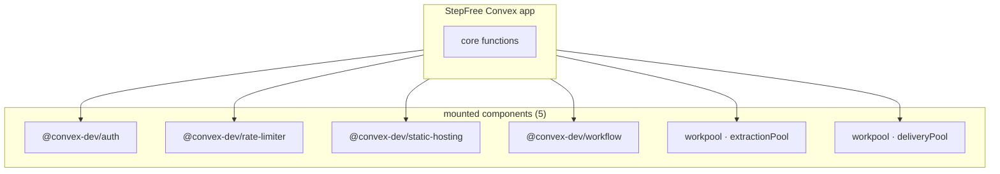
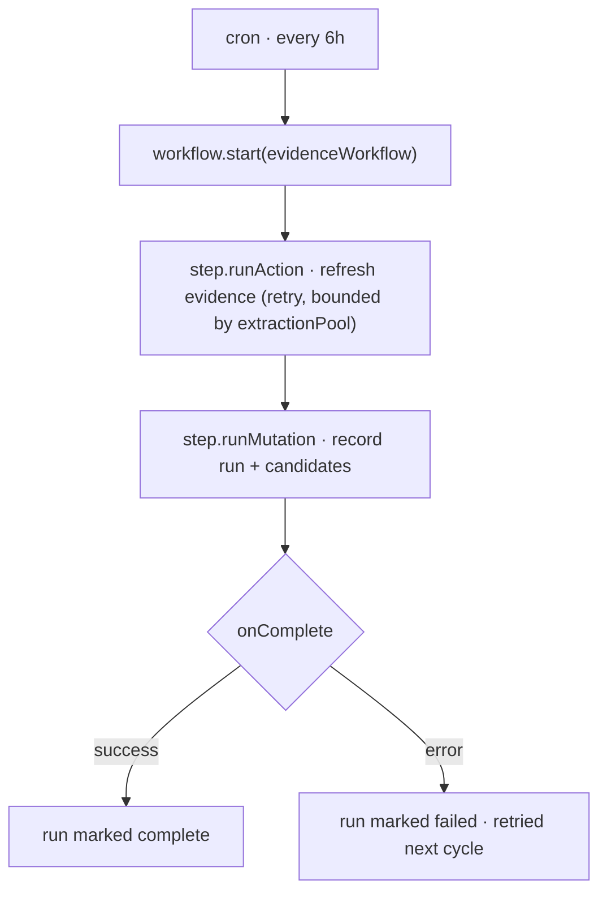
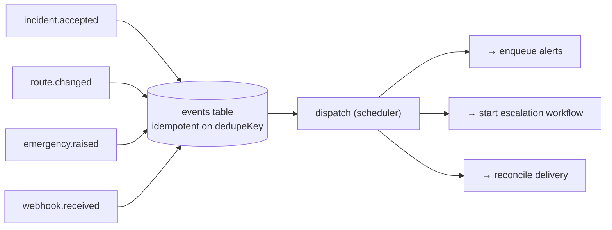
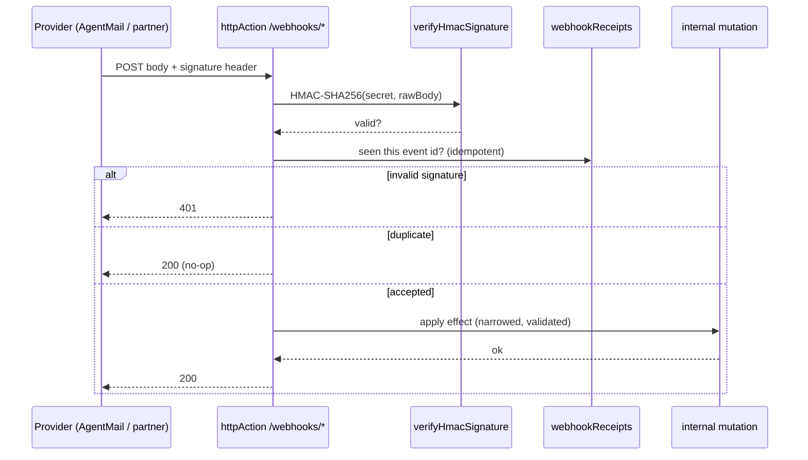
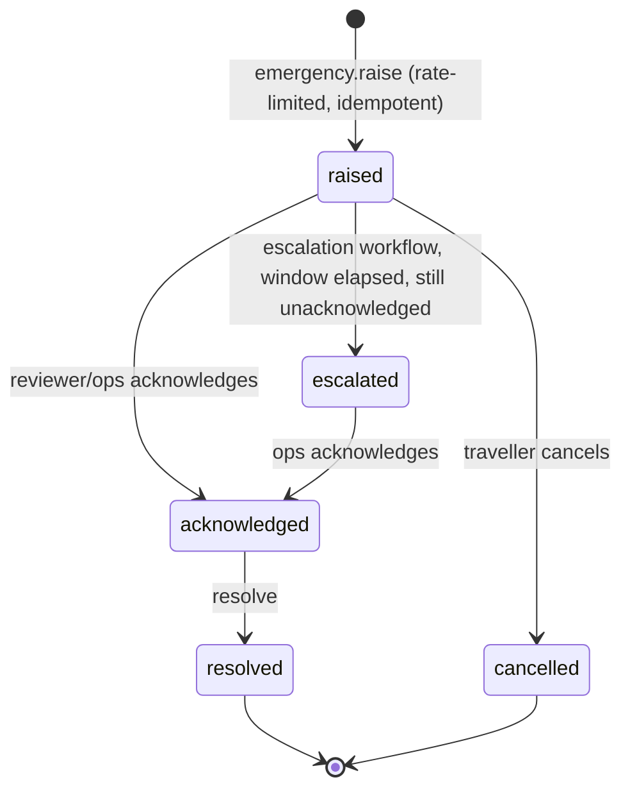
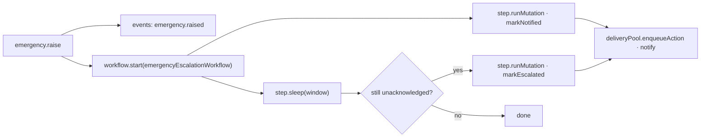

# StepFree — system architecture & the depth plan

This document is the engineering gap-map against **Parallel** (`Enoch208/parallel@b3918049`) and the design for closing it **without fake complexity**. Every addition deepens the real incident → reroute → alert → escalation path.

## Gap map (audited, reproducible)

Numbers come from an identical script run over both repos (`scripts/audit-convex.sh`).

| Axis | Parallel | StepFree (before) | StepFree (target) | Strategy |
| --- | ---: | ---: | ---: | --- |
| Convex functions | 103 | 52 | **> 103** | Real subsystems: event bus, emergency, webhooks, workflow steps, delivery |
| Tables | 19 | 15 | **≥ 20** | `events`, `idempotencyKeys`, `emergencies`, `inboundMessages`, `webhookReceipts` |
| Indexes | 35 | 39 | **> 50** | Every new table fully indexed; no full scans |
| Mounted components | 4 | 3 | **5** | + `@convex-dev/workflow`, + `@convex-dev/workpool` (×2 named) |
| Durable workflows | 1 | 0 | **2** | evidence pipeline + emergency escalation |
| Workpools | 1 | 0 | **2** | `extractionPool` (scrape/LLM), `deliveryPool` (outbound) |
| HTTP actions / webhooks | 2 | 0 | **≥ 3** | AgentMail inbound, AgentMail delivery, partner lift-status, health |
| Webhook signature verification | Svix | — | **HMAC-SHA256, timing-safe** | `convex/lib/webhookAuth.ts` |
| Event bus | — | — | **yes** | `events` table + idempotent publish + scheduler dispatch |
| Idempotency | records | keys on 3 tables | **first-class helper** | `convex/lib/idempotency.ts`, used by every ingress |
| Crons | 3 | 2 | **≥ 3** | + event/webhook-receipt cleanup |
| Emergency service | — | — | **yes** | SOS → event → durable escalation |

**Where StepFree already leads and keeps leading:** more indexes than Parallel, Convex Auth (they have none), the rate-limiter component (they have none), the human-review safety gate, and per-session isolation.

## New components

## Durable evidence workflow (workflow + workpool together)

The 6-hour evidence run becomes a durable workflow whose heavy scrape/LLM step is bounded by `extractionPool`. A crash resumes from the last completed step instead of re-scraping.

## Event bus

A single idempotent publish point decouples producers (reviewer accepts, lift restored, SOS raised, webhook received) from consumers (alerts, escalation, reconciliation). Duplicate events collapse on `dedupeKey`.

## Webhook ingress with HMAC verification + idempotency

Every inbound webhook is verified (timing-safe HMAC-SHA256), de-duplicated on the provider event id, then reduced to an internal mutation. Handlers narrow `unknown` and fail closed.

**Delivery webhook** advances the alert state machine into its previously-unreachable `delivered` / `bounced` states, keyed by `providerMessageId`.

## Emergency service (SOS)

A traveller stuck at a broken barrier raises an SOS. It is rate-limited, idempotent per session-window, published to the bus, and escalated by a durable workflow if no one acknowledges in time.

## Data model additions

| Table | Purpose | Key indexes |
| --- | --- | --- |
| `events` | Event bus log, idempotent on `dedupeKey` | `by_dedupe`, `by_status`, `by_type_and_created` |
| `idempotencyKeys` | First-class idempotency claims across ingress points | `by_scope_and_key` |
| `emergencies` | SOS lifecycle (raised→acknowledged→escalated→resolved) | `by_session`, `by_status`, `by_station`, `by_idempotency` |
| `inboundMessages` | Parsed inbound email replies (AgentMail) | `by_provider_message`, `by_from`, `by_idempotency` |
| `webhookReceipts` | Verified/duplicate/rejected webhook audit | `by_source_and_event`, `by_received_at` |

## Non-negotiables (kept from the safety model)

- Routing stays deterministic; no model in the decision path.
- Inbound feeds (partner lift-status, TfL) remain **advisory** until human-reviewed.
- Mutations never call the network; all provider I/O is in actions, bounded by workpools.
- Every query uses an index; no `.collect()` on unbounded tables.
