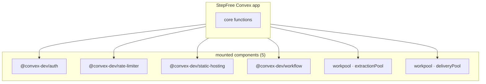
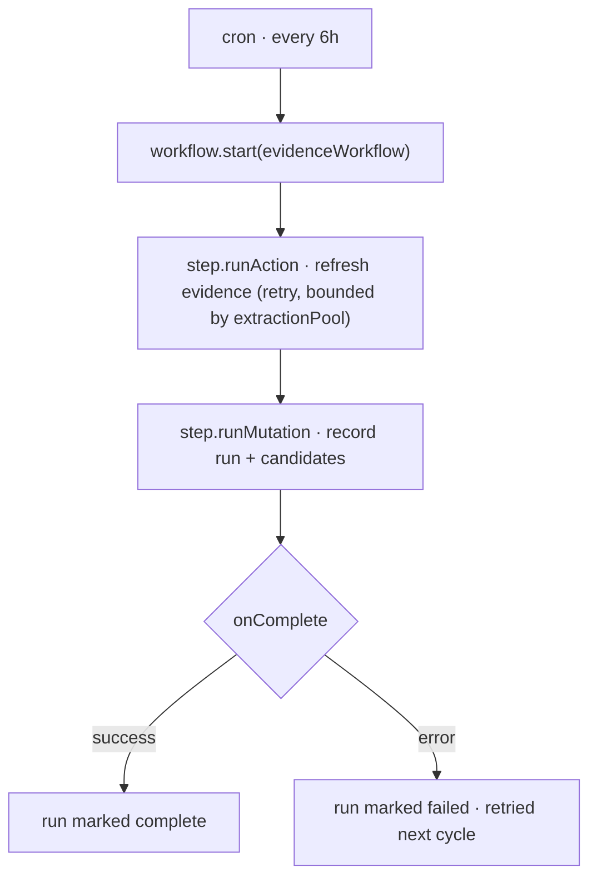
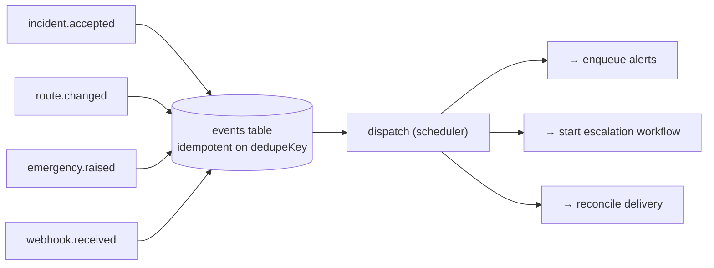
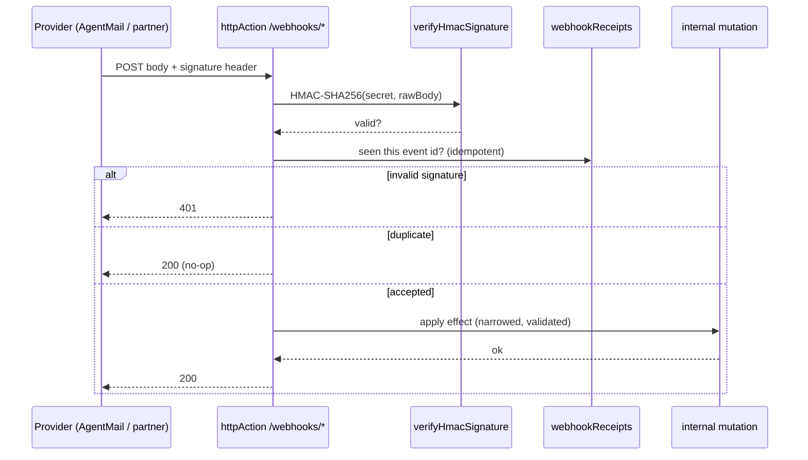
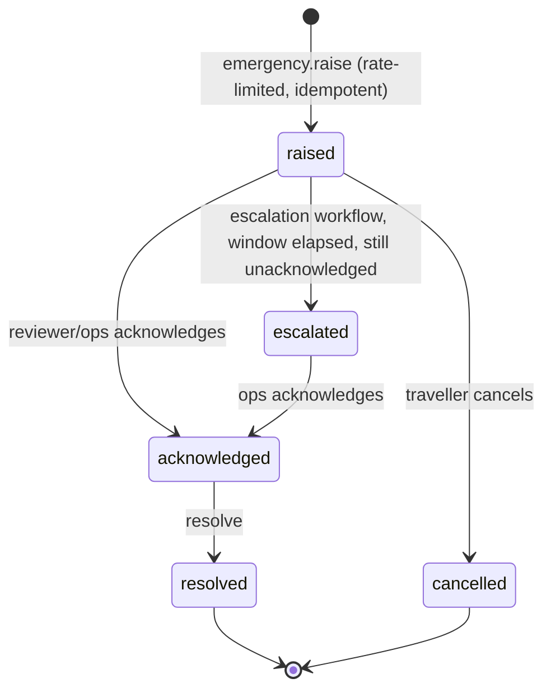
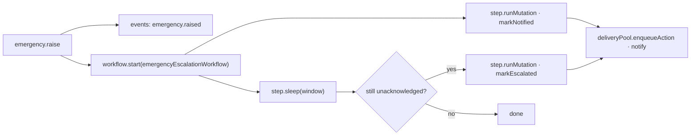

# StepFree — system architecture

This document is the full engineering map of StepFree: the deterministic incident → reroute → alert → escalation path, and every subsystem that supports it. Nothing here is decorative — each piece deepens that one path.

## Capability map (audited, reproducible)

Numbers come from `scripts/audit-convex.sh`, run against this repo.

| Capability | Count / detail | Where |
| --- | --- | --- |
| Convex functions | **77** (20 public queries, 18 public mutations, 3 public actions, 36 internal) | across `convex/*.ts` |
| Tables | **20** | `convex/schema.ts` |
| Indexes | **55** | every table fully indexed; no full scans |
| Mounted components | **5** (auth, rate-limiter, static-hosting, workflow, workpool ×2) | `convex/convex.config.ts` |
| Durable workflows | **2** (evidence pipeline, emergency escalation) | `convex/workflows.ts` |
| Workpools | **2** (`extractionPool`, `deliveryPool`) | `convex/pools.ts` |
| HTTP routes | **4** (AgentMail delivery + inbound, partner lift-status, health) | `convex/http.ts` |
| Webhook signature verification | **HMAC-SHA256, timing-safe** | `convex/lib/webhookAuth.ts` |
| Event bus | idempotent publish on `dedupeKey` + scheduler dispatch | `convex/events.ts` |
| Idempotency | first-class claim helper, used by every ingress | `convex/lib/idempotency.ts` |
| Crons | **3** (TfL sync, evidence workflow, cleanup) | `convex/crons.ts` |
| Emergency service | SOS → event → durable escalation | `convex/emergency.ts` |
| Automated tests | **54** across 10 files | `convex/**/*.test.ts` |

**Foundational guarantees:** deterministic Dijkstra routing behind a human-review gate, Convex Auth, the rate-limiter on every ingress, verbatim-excerpt evidence verification, and per-session isolation.

## New components

## Durable evidence workflow (workflow + workpool together)

The 6-hour evidence run becomes a durable workflow whose heavy scrape/LLM step is bounded by `extractionPool`. A crash resumes from the last completed step instead of re-scraping.

## Event bus

A single idempotent publish point decouples producers (reviewer accepts, lift restored, SOS raised, webhook received) from consumers (alerts, escalation, reconciliation). Duplicate events collapse on `dedupeKey`.

## Webhook ingress with HMAC verification + idempotency

Every inbound webhook is verified (timing-safe HMAC-SHA256), de-duplicated on the provider event id, then reduced to an internal mutation. Handlers narrow `unknown` and fail closed.

**Delivery webhook** advances the alert state machine into its previously-unreachable `delivered` / `bounced` states, keyed by `providerMessageId`.

## Emergency service (SOS)

A traveller stuck at a broken barrier raises an SOS. It is rate-limited, idempotent per session-window, published to the bus, and escalated by a durable workflow if no one acknowledges in time.

## Data model additions

| Table | Purpose | Key indexes |
| --- | --- | --- |
| `events` | Event bus log, idempotent on `dedupeKey` | `by_dedupe`, `by_status`, `by_type_and_created` |
| `idempotencyKeys` | First-class idempotency claims across ingress points | `by_scope_and_key` |
| `emergencies` | SOS lifecycle (raised→acknowledged→escalated→resolved) | `by_session`, `by_status`, `by_station`, `by_idempotency` |
| `inboundMessages` | Parsed inbound email replies (AgentMail) | `by_provider_message`, `by_from`, `by_idempotency` |
| `webhookReceipts` | Verified/duplicate/rejected webhook audit | `by_source_and_event`, `by_received_at` |

## Non-negotiables (kept from the safety model)

- Routing stays deterministic; no model in the decision path.
- Inbound feeds (partner lift-status, TfL) remain **advisory** until human-reviewed.
- Mutations never call the network; all provider I/O is in actions, bounded by workpools.
- Every query uses an index; no `.collect()` on unbounded tables.
