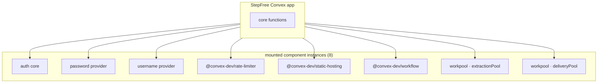
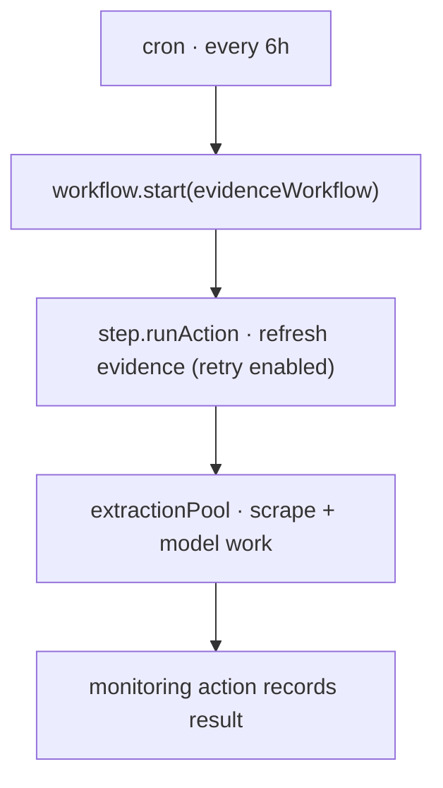
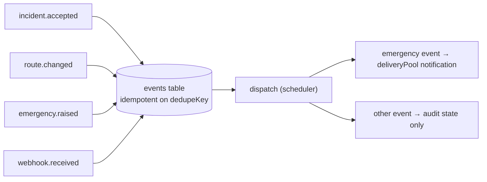
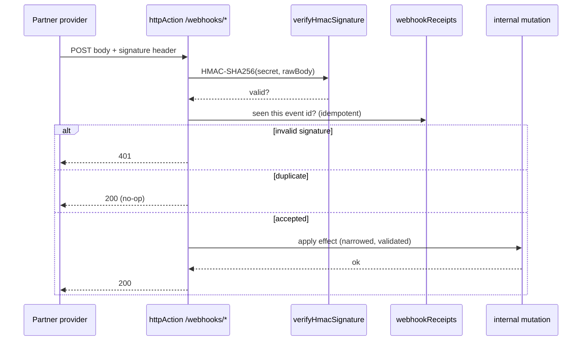
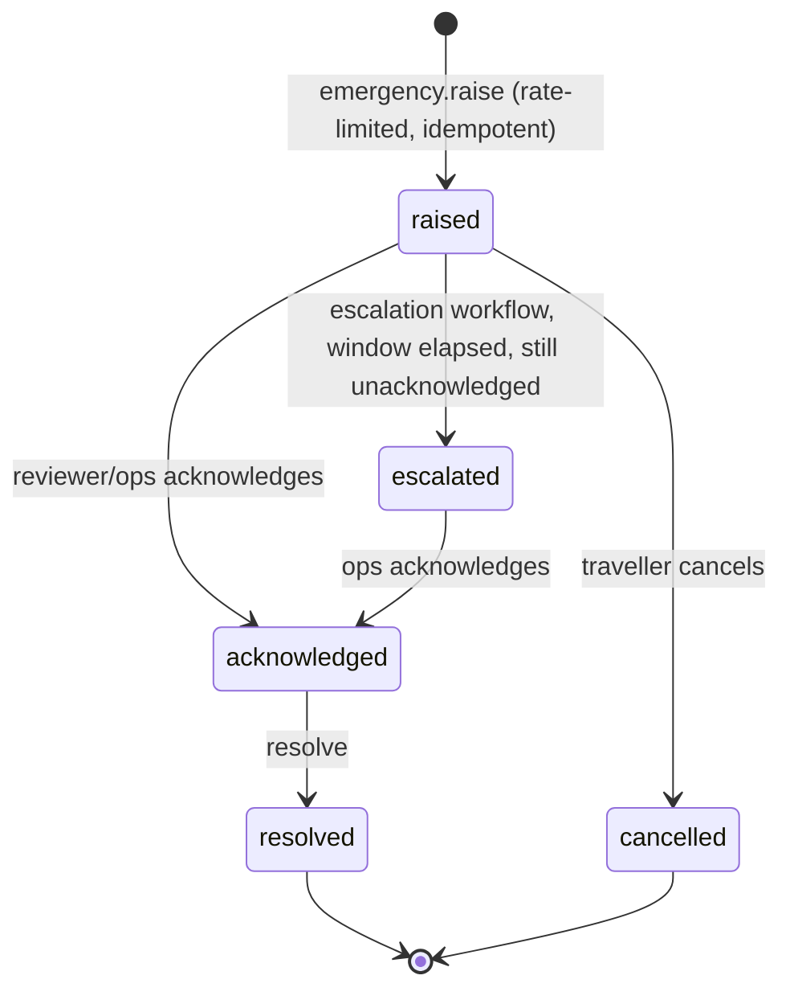
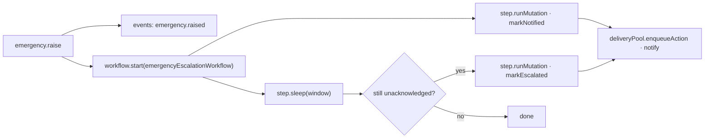

# StepFree system architecture

This document maps the deterministic incident → reroute → alert → escalation path and the subsystems that support it.

## Capability map (audited, reproducible)

Numbers come from `scripts/audit-convex.sh`, run against this repo.

| Capability | Count / detail | Where |
| --- | --- | --- |
| Convex handlers | **112** (37 public queries, 27 public mutations, 3 public actions, 40 internal, 5 HTTP actions) | across `convex/*.ts` |
| Tables | **22** | `convex/schema.ts` |
| Indexes | **57** | named access paths in `convex/schema.ts` |
| Mounted component instances | **8** (auth core, password, username, rate-limiter, static-hosting, workflow, workpool ×2) | `convex/convex.config.ts` |
| Durable workflows | **2** (evidence pipeline, emergency escalation) | `convex/workflows.ts` |
| Workpools | **2** (`extractionPool`, `deliveryPool`) | `convex/pools.ts` |
| HTTP routes | **4** (AgentMail delivery + inbound, partner lift-status, health) | `convex/http.ts` |
| Webhook signature verification | timing-safe HMAC-SHA256 for the partner endpoint; AgentMail Svix adapter still pending | `convex/lib/webhookAuth.ts`, `convex/http.ts` |
| Event record | idempotent publish on `dedupeKey`; the current meaningful consumer handles emergency notifications | `convex/events.ts` |
| Idempotency | first-class claim helper, used by every ingress | `convex/lib/idempotency.ts` |
| Crons | **4** (TfL sync, evidence workflow, cleanup, stuck-alert reconcile) | `convex/crons.ts` |
| Emergency service | SOS modal → event → durable escalation → notes | `convex/emergency.ts` |
| Automated tests | **100** across 20 files | `convex/**/*.test.ts` |

**Foundational guarantees:** deterministic Dijkstra routing behind a human-review gate, Convex Auth, rate limits around costly and exposed operations, verbatim evidence verification, and per-session drill isolation.

## New components

## Durable evidence workflow (workflow + workpool together)

The 6-hour evidence run is started as a durable workflow. Its current implementation contains one retryable action that performs the scrape and extraction. `extractionPool` bounds concurrency inside that action. The workflow provides durable retry, but the scrape and model call are not yet separate resumable workflow steps.

## Event record and dispatcher

A single idempotent publish point records reviewer, restoration, emergency, and webhook events. Duplicate events collapse on `dedupeKey`. The dispatcher currently performs a meaningful side effect only for `emergency.raised` and `emergency.escalated`, which enqueue the emergency notification action. Other event types are retained for audit and operations visibility. This is not a general multi-consumer pub/sub system yet.

## Webhook ingress status

The partner lift-status endpoint verifies a timing-safe HMAC-SHA256 signature, deduplicates the provider event ID, and reduces the request to an internal mutation. The two AgentMail endpoints currently reuse that generic envelope. AgentMail uses Svix headers and nested payloads, so those endpoints are not production-verified until the adapter is replaced and tested against real events.

The generic delivery handler can advance an alert to `delivered` or `bounced` by `providerMessageId`. That transition is covered by local tests, not a verified AgentMail production webhook.

## Emergency service (SOS)

A traveller stuck at a broken barrier raises an SOS. It is rate-limited, idempotent per session-window, published to the bus, and escalated by a durable workflow if no one acknowledges in time.

## Data model additions

| Table | Purpose | Key indexes |
| --- | --- | --- |
| `events` | Event bus log, idempotent on `dedupeKey` | `by_dedupe`, `by_status`, `by_type_and_created` |
| `idempotencyKeys` | First-class idempotency claims across ingress points | `by_scope_and_key` |
| `emergencies` | SOS lifecycle (raised→acknowledged→escalated→resolved) | `by_session`, `by_status`, `by_station`, `by_idempotency` |
| `inboundMessages` | Parsed inbound email replies (AgentMail) | `by_provider_message`, `by_from`, `by_idempotency` |
| `webhookReceipts` | Verified/duplicate/rejected webhook audit | `by_source_and_event`, `by_received_at` |
| `emergencyNotes` | Traveller/operator note timeline on an SOS | `by_emergency` |
| `proofRuns` | Immutable, shareable reroute receipts | `by_code` |

## Non-negotiables (kept from the safety model)

- Routing stays deterministic; no model in the decision path.
- Inbound feeds (partner lift-status, TfL) remain **advisory** until human-reviewed.
- Mutations never call the network; all provider I/O is in actions, bounded by workpools.
- Operational lookups use named indexes. The fixed 9-station routing graph is intentionally collected in memory and must change before a full-network import.
