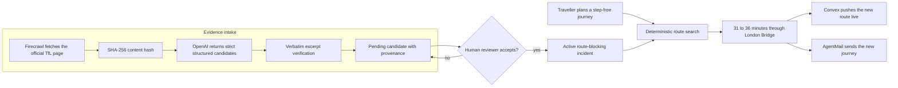
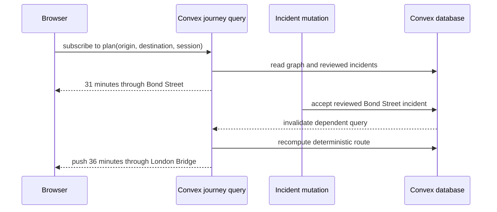
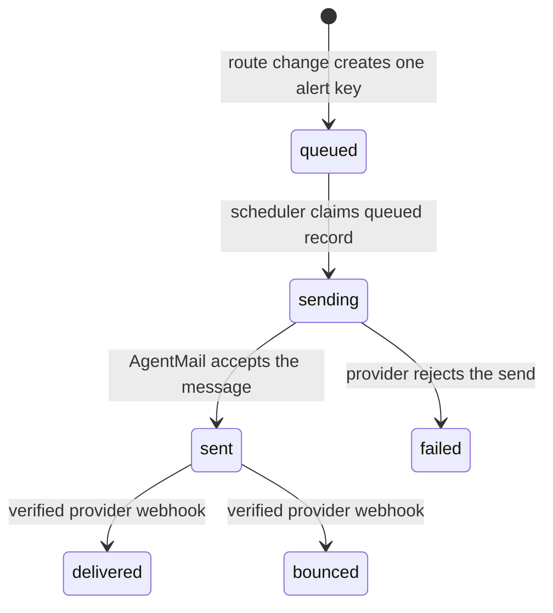
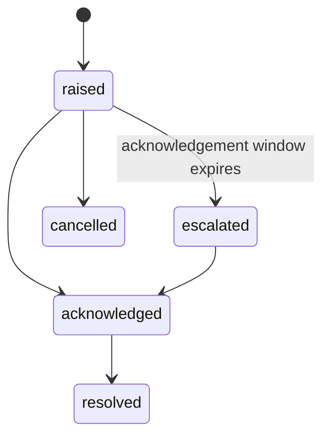

# StepFree

## When the lift fails, the journey should not

StepFree is a live accessibility layer for public transit. It watches official access notices, verifies the evidence, reroutes a wheelchair user around a failed lift, and sends the new step-free journey before the traveller reaches the barrier.

  

### Open the real product

- **Live application:** [whimsical-ferret-778.convex.site](https://whimsical-ferret-778.convex.site)
- **90-second judge path:** [whimsical-ferret-778.convex.site/proof](https://whimsical-ferret-778.convex.site/proof)
- **Street navigator:** [whimsical-ferret-778.convex.site/navigate](https://whimsical-ferret-778.convex.site/navigate)
- **Operations console:** [whimsical-ferret-778.convex.site/ops](https://whimsical-ferret-778.convex.site/ops)
- **Source:** [github.com/treasure567/stepfree](https://github.com/treasure567/stepfree)
- **Demo video:** VIDEO_URL
- **Launch post:** LAUNCH_POST_URL

## At a glance, for judging

- **What it is** — an everyday app for wheelchair users and anyone who can't take stairs. It notices the lift on your route just failed and reroutes you step-free **before** you reach the barrier, then emails you the new journey. Not a developer tool.
- **Would a real person use it this week** — yes: about a third of London Underground stations are step-free, lifts fail daily, and today's planners keep calling a station accessible after its lift breaks. StepFree closes that gap.
- **Convex depth** — 117 exported handlers, 23 tables and 61 indexes, reactive route queries that push updates with no browser polling, Convex Auth, 8 mounted components (including `@convex-dev/workflow` and two `@convex-dev/workpool` instances), 4 crons, and signed HTTP webhooks. The route is computed inside a Convex mutation and served from `convex.site`.
- **Sponsors doing real work** — Firecrawl **crawls** the official TfL accessibility page (with provenance); OpenAI **generates** structured incidents plus a verbatim source quote; AgentMail **sends** the reroute alert and **receives** the traveller's reply through a Svix-verified webhook (two-way). None of them just sit in the README.
- **Live on convex.site** — [whimsical-ferret-778.convex.site](https://whimsical-ferret-778.convex.site); the full judge path needs no login at [`/proof`](https://whimsical-ferret-778.convex.site/proof).

## The moment we built for

Maya plans a step-free journey from **Waterloo to Barbican**. The best route takes **31 minutes through Bond Street**.

Then the Bond Street lift fails.

A normal journey planner can keep calling the station accessible until the traveller reaches the broken lift. StepFree treats the live access state as part of the route itself. Once evidence is verified and accepted, the journey changes to **36 minutes through London Bridge**.

Five minutes longer. Zero stairs. No dead end.

  

## What a judge can do in 90 seconds

Open [`/proof`](https://whimsical-ferret-778.convex.site/proof). No account is required.

1. See the baseline route, Waterloo to Barbican in 31 minutes through Bond Street.
2. Inspect the evidence record, including the official source, model, source hash, exact excerpt, confidence, and review state.
3. Press **Break a lift on this route**.
4. Keep the map open. Convex pushes a new route through London Bridge in 36 minutes without a refresh or browser polling.
5. Press **Run the attacks**. Six adversarial checks execute against the production rules and report what was refused.
6. Press **Share this rescue**. StepFree creates a permanent receipt containing the before route, after route, affected lift, evidence hash, and safety results.
7. Start the journey to watch the wheelchair follow the new path, or raise an SOS to create a timed emergency case for the operations team.
8. Send the reroute alert. The AgentMail provider message ID is stored with the alert.

## The traveller, not the dashboard

StepFree is designed around the person moving through the station:

- An installable web application that works on a phone.
- A wheelchair-aware street map built with MapLibre and OpenStreetMap.
- Turn-by-turn wheelchair routing through Valhalla.
- Mobility preferences for wheelchair use, step avoidance, lift dependence, walking tolerance, and assistance needs.
- Saved journeys and route watches.
- Email verification and route-change alerts.
- An SOS flow with acknowledgement, escalation, notes, and resolution.
- A live station board showing operating, advisory, and lift-down states.

  

## The rule that protects every route

> **AI reads the notice. It does not declare a route safe.**

OpenAI returns incident candidates. It never activates an incident and never chooses a route.

StepFree checks that the model's quoted evidence exists character-for-character in the Firecrawl source. Unknown stations and low-confidence candidates remain pending. A human reviewer must accept a route-blocking incident before the deterministic Dijkstra router excludes the affected station.

The real TfL lift feed remains advisory until review. A provider response, network feed, model output, or another visitor's drill cannot silently change a traveller's route.

## From source page to safer route

1. A six-hour cron starts the evidence workflow.
2. Firecrawl fetches a fixed official TfL accessibility page as clean markdown. Users cannot supply the URL.
3. The source is hashed. Unchanged content skips another model run.
4. OpenAI `gpt-5.4-mini` returns strict JSON containing candidates and exact source excerpts.
5. StepFree verifies each excerpt, resolves the station, stores the model and source provenance, and leaves the candidate pending.
6. An authenticated reviewer accepts or rejects the candidate.
7. Only accepted, route-blocking incidents enter the deterministic routing graph.
8. Convex reruns the subscribed journey query and pushes the new result to every affected screen.
9. The alert pipeline schedules an AgentMail message off the transactional write path.

## One Convex deployment

The Next.js application is exported as static files and served from `convex.site`. Convex owns the database, authentication, reactive route queries, review rules, scheduled work, crons, workflows, workpools, webhooks, emergency state, operations data, and the site itself.

The application currently contains:

| Capability | Shipped implementation |
| --- | --- |
| Exported Convex handlers | **117** queries, mutations, actions, and HTTP actions |
| Database | **23 tables** and **61 indexes** |
| Components | **8 mounted instances** |
| Workflows | **2 durable workflows** |
| Workpools | **2 bounded pools** |
| Recurring work | **4 crons** |
| Deferred work | **8 scheduler hand-offs** |
| Rate controls | **17 named limits** |
| HTTP ingress | **3 explicit routes**: health, unified AgentMail webhook, and partner lift status, plus auth and static routes |
| Automated verification | **107 passing tests across 22 files**, plus `scripts/audit-convex.sh` |

### Mounted components

| Component instance | Responsibility |
| --- | --- |
| Convex Auth core | Identity and authenticated sessions |
| Password provider | Email and password sign-in |
| Username provider | Username sign-in |
| `@convex-dev/rate-limiter` | Limits expensive and public operations |
| `@convex-dev/static-hosting` | Serves the exported application from `convex.site` |
| `@convex-dev/workflow` | Carries evidence refresh and emergency escalation |
| `@convex-dev/workpool` extraction pool | Bounds scrape and model concurrency to three jobs |
| `@convex-dev/workpool` delivery pool | Bounds notification concurrency to five jobs |

## The live update is the product

The browser keeps one Convex subscription to the current journey. It does not poll.

The route query reads the incident state it uses to calculate the plan. When that state changes, Convex invalidates the query, recomputes it, and pushes the result. The screen and the routing decision cannot drift into separate databases.

## The station graph and the real world

  

The current London pilot is deliberately small: **9 stations and 9 accessible connections**. StepFree loads that fixed graph in memory and runs Dijkstra over the accessible edges. This is enough to prove the decision boundary, live update, and alert chain without pretending the full TfL network has been imported.

The street layer is separate. It asks Valhalla for wheelchair routing between coordinates and renders the result with MapLibre. Public OpenStreetMap tiles and the public routing endpoint are suitable for the demonstration, not a high-volume release.

## The alert path

Alerts are stored work, not a loop that calls an email API inside a mutation.

- A route watch stores its current fingerprint and affected-station index.
- A meaningful route change creates one alert per watch and change key.
- A per-watch budget prevents a flapping incident from draining the mailbox.
- A scheduled action claims only `queued` work.
- SMTP delivery uses the AgentMail inbox address as the username and the AgentMail API key as the password.
- The real provider message ID is written back to the alert.
- A Svix-signed HTTP endpoint receives inbound AgentMail events, deduplicates each event, and records the outcome.

Outbound AgentMail delivery has completed in production. One real reroute alert reached the inbox with provider message ID `401f23b1-2156-0c9a-114a-99645fbaa346@agentmail.to`.

The return path is live too. Inbound messages and delivery events reach the same production webhook. The handler verifies `svix-id`, `svix-timestamp`, and `svix-signature` against the raw body, using base64 HMAC-SHA256 over `id.timestamp.body` with a replay window. Five focused tests cover valid signatures, rotated signature sets, tampered payloads, stale timestamps, and missing headers or secrets.

## Sponsor stack, with product responsibility

| Sponsor | What it does for the traveller | Evidence |
| --- | --- | --- |
| **Convex** | Holds every product state, authenticates users, calculates and pushes the route, schedules delivery, runs reviews, records operations activity, and serves the application | `convex/schema.ts`, `convex/routes.ts`, `convex/review.ts`, `convex/workflows.ts`, `convex/http.ts` |
| **Firecrawl** | Fetches the official TfL accessibility page that becomes the evidence source | `convex/providers/firecrawl.ts`, `convex/monitoring.ts` |
| **OpenAI** | Extracts structured incident candidates and exact source excerpts for review | `convex/providers/openai.ts`, `convex/monitoring.ts` |
| **AgentMail** | Sends account codes and route alerts, then returns signed delivery and inbound events to Convex | `convex/emailSend.ts`, `convex/alerts.ts`, `convex/http.ts`, `convex/webhooks.ts` |

## Production evidence

### Firecrawl and OpenAI

On **22 September 2026 at 01:39 WAT**, the production monitoring job completed against the official Transport for London accessibility works page.

- Firecrawl fetched the source.
- The source hash and fetch time were stored.
- OpenAI processed it with `gpt-5.4-mini`.
- The page contained zero matching incident candidates.
- StepFree stored zero rather than fabricating an outage for the demo.

### AgentMail

The original REST key did not carry `message_send`, so StepFree used AgentMail's documented SMTP transport. A real route alert reached the destination inbox. Convex stored the provider message ID and advanced the alert to `sent`.

AgentMail is verified in both directions. Outbound messages leave through SMTP. Inbound replies, delivery confirmations, and bounce events return through one Svix-verified production endpoint at `/webhooks/agentmail`. Event IDs are deduplicated before a delivery state or traveller reply can be applied.

### Controlled incident

The Bond Street outage on `/proof` is a labelled, session-isolated drill. It lets every judge trigger the complete route decision without waiting for a real lift to fail. The drill never changes global incidents or another visitor's route.

## Six attacks against one reroute

The **Run the attacks** control executes real guard code against throwaway data and cleans it up afterwards.

| Attack | Rule StepFree enforces |
| --- | --- |
| Fabricated source excerpt | A quote that is absent from the scraped source cannot become evidence |
| Cross-session incident | One visitor's drill cannot change another visitor's plan |
| Unreviewed feed item | Advisory data cannot block a route |
| Low-confidence candidate | Weak extraction remains pending |
| Replayed webhook or action | Idempotency keys collapse duplicate effects |
| Stale state transition | A state change is accepted only from its expected prior state |

## Emergency response

An SOS creates a transactional emergency record with one idempotency key. A durable workflow waits for the acknowledgement window, checks the current state, and escalates only if nobody has responded. Operators can acknowledge, assign, add notes, and resolve the case in `/ops`.

## Operations without hidden state

The authenticated `/ops` console exposes:

- Evidence candidates awaiting review.
- Accepted and rejected incident decisions.
- AgentMail sends and provider message IDs.
- Firecrawl and OpenAI processing activity.
- Webhook receipts and duplicate detection.
- Failed event replay.
- Active, acknowledged, escalated, and resolved emergencies.
- Provider and date filters with paginated activity.
- Manual evidence refresh and TfL synchronization.
- A direct operations entry point in the landing navigation and footer.
- A production-facing operations header without the old demo label.

## Data model

The 23 tables are grouped by responsibility.

| Area | Tables |
| --- | --- |
| Accessible network | `stations`, `connections`, `lifts`, `incidents`, `demoIncidents` |
| Evidence | `sourceSnapshots`, `monitoringRuns`, `incidentCandidates` |
| Travellers | `users`, `journeys`, `routeWatches`, `watchStations`, `reports` |
| Communication | `alerts`, `emailVerifications`, `inboundMessages`, `webhookReceipts` |
| Reliability | `events`, `idempotencyKeys`, `activity` |
| Emergency | `emergencies`, `emergencyNotes` |
| Proof | `proofRuns` |

## Security boundaries

- Provider keys live in Convex environment variables, never in the browser.
- The evidence crawler accepts one fixed official URL, not user-supplied targets.
- Verification codes are hashed with SHA-256 and `OTP_PEPPER`, expire after 10 minutes, and lock after five failed attempts.
- Account, reviewer, and operations mutations derive identity from Convex Auth.
- Alert email addresses are masked in public query results.
- Public and expensive actions are rate-limited.
- AgentMail webhook signatures use the raw body, Svix headers, HMAC-SHA256, and a timestamp tolerance.
- Webhook event IDs and user-visible write keys are deduplicated before applying effects.

## What is real, controlled, and unfinished

### Real in production

- The Convex deployment and static application.
- Account creation, sign-in, mobility profiles, and verification state.
- Reactive journey recomputation.
- Firecrawl and OpenAI evidence processing with stored provenance.
- TfL advisory synchronization.
- AgentMail SMTP delivery with a real provider message ID.
- Operations, emergency, receipt, and safety-attack state machines.

### Controlled for repeatable judging

- The 9-station London graph.
- The Bond Street lift failure.
- The journey animation.

### Still to finish before submission

- Record and upload the under-three-minute demo.
- Publish the social launch post and add its URL.
- Make the repository public before the final submission.

## Build log

Every entry below links to the actual repository commit.

### Foundation

- [`6643f73`](https://github.com/treasure567/stepfree/commit/6643f73) created the Next.js application.
- [`67f367b`](https://github.com/treasure567/stepfree/commit/67f367b) configured the TypeScript, Convex, test, and package toolchain.
- [`4e0c412`](https://github.com/treasure567/stepfree/commit/4e0c412) added accounts and mobility profiles.
- [`5545683`](https://github.com/treasure567/stepfree/commit/5545683) implemented the first accessible route planner.

### Evidence and route safety

- [`2cc042a`](https://github.com/treasure567/stepfree/commit/2cc042a) added official-source evidence verification.
- [`e74f4a6`](https://github.com/treasure567/stepfree/commit/e74f4a6) built idempotent route-change alerts.
- [`270a873`](https://github.com/treasure567/stepfree/commit/270a873) isolated production drills by visitor session.
- [`808a8a7`](https://github.com/treasure567/stepfree/commit/808a8a7) mounted the Convex components and static host.

### Traveller experience

- [`63e5d18`](https://github.com/treasure567/stepfree/commit/63e5d18) established the installable application shell.
- [`8258e8e`](https://github.com/treasure567/stepfree/commit/8258e8e) built the landing experience and route story.
- [`e5ffe14`](https://github.com/treasure567/stepfree/commit/e5ffe14) connected personalized mobility preferences.
- [`145c40f`](https://github.com/treasure567/stepfree/commit/145c40f) added live wheelchair street navigation.
- [`df86c03`](https://github.com/treasure567/stepfree/commit/df86c03) added the public production proof console.
- [`7f41d32`](https://github.com/treasure567/stepfree/commit/7f41d32) prepared the first submission artifacts and demo plan.
- [`95d122e`](https://github.com/treasure567/stepfree/commit/95d122e) fixed clean direct links for exported routes.

### Reliability and operations

- [`b794d2f`](https://github.com/treasure567/stepfree/commit/b794d2f) documented the system architecture and data flow.
- [`d191d3e`](https://github.com/treasure567/stepfree/commit/d191d3e) added workflows, workpools, event records, webhook ingress, and emergency state.
- [`47c2e26`](https://github.com/treasure567/stepfree/commit/47c2e26) added the vector system-design diagrams.
- [`90784d9`](https://github.com/treasure567/stepfree/commit/90784d9) added SOS and the on-map journey simulation.
- [`1478550`](https://github.com/treasure567/stepfree/commit/1478550) built the authenticated operations and review console.
- [`e134c58`](https://github.com/treasure567/stepfree/commit/e134c58) connected operations navigation and demo sign-in.
- [`f22ffb3`](https://github.com/treasure567/stepfree/commit/f22ffb3) made `/ops` directly addressable on the static host.
- [`abca5cb`](https://github.com/treasure567/stepfree/commit/abca5cb) added six adversarial checks, shareable receipts, and network status.
- [`09fad3b`](https://github.com/treasure567/stepfree/commit/09fad3b) aligned the operations console with the StepFree interface.

### Production proof and verification

- [`06ed3e1`](https://github.com/treasure567/stepfree/commit/06ed3e1) delivered AgentMail messages through SMTP and stored real provider receipts.
- [`10b2fcf`](https://github.com/treasure567/stepfree/commit/10b2fcf) expanded the automated suite, added CI, and fixed the ES2022 build target.
- [`77b96f5`](https://github.com/treasure567/stepfree/commit/77b96f5) added provider-attributed activity records and richer operations visibility.
- [`15915ea`](https://github.com/treasure567/stepfree/commit/15915ea) refreshed production evidence and judge-facing assets.
- [`c9aa393`](https://github.com/treasure567/stepfree/commit/c9aa393) added activity filters, webhook pagination, and the correct drill recipient path.
- [`8a6cb6c`](https://github.com/treasure567/stepfree/commit/8a6cb6c) fixed frozen CI installation for the native resolver dependency.
- [`a597275`](https://github.com/treasure567/stepfree/commit/a597275) unified AgentMail events behind Svix verification and added the operations entry point to the landing page.
- [`43ae2b5`](https://github.com/treasure567/stepfree/commit/43ae2b5) broadened the AgentMail event envelopes and refreshed the audited architecture counts.

## Generated visual disclosure

The wheelchair scene images in this document are AI-generated concept art used to communicate the product scenario. They are not photographs of interviewed users. The live maps, production screens, evidence records, provider receipts, test results, and system diagrams are product artifacts.

## Attributions

- Map data: © [OpenStreetMap](https://www.openstreetmap.org/copyright) contributors.
- Street routing: [Valhalla](https://github.com/valhalla/valhalla).
- Transit context: [Transport for London Open Data](https://tfl.gov.uk/info-for/open-data-users/).
- Code: [MIT License](LICENSE).
